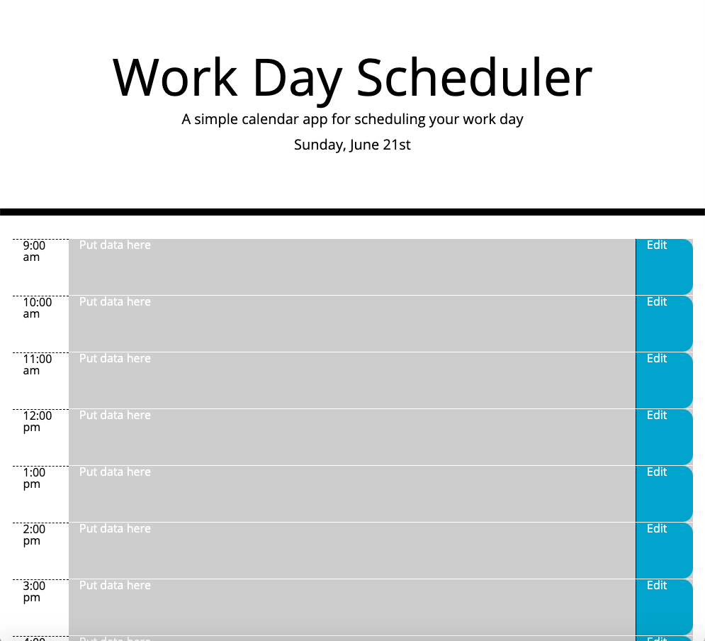

# Work Day Scheduler

Welcome to the README for my fifth project as a student of Coding Boot Camp at UCLA Extension: The Work Day Scheduler.

## Description

My fifth project is the Work Day Scheduler: An application that allows the user to add important events to a daily planner to manage their time effectively. Third-party APIs used in the development of the application include jQuery, Bootstrap and Moment.js. 

## Link

[Work Day Scheduler](https://seanc0ne.github.io/work-day-scheduler/)

## Screenshot

